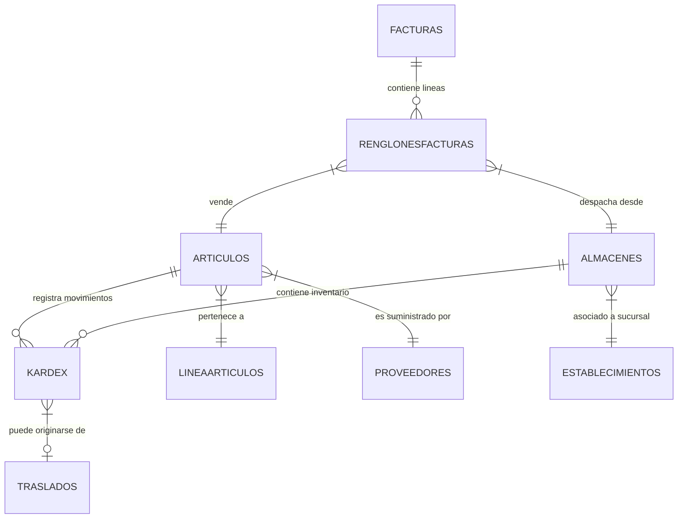
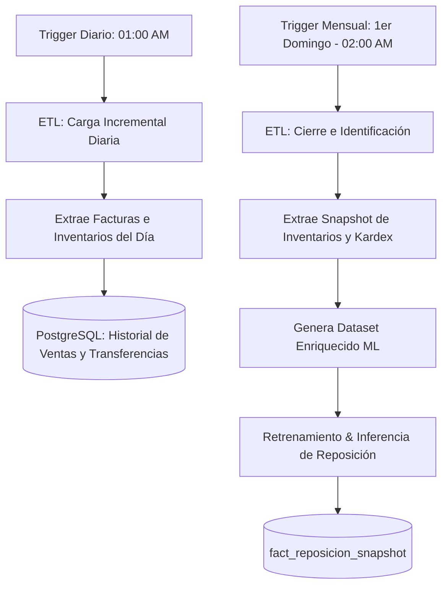

# DISEÑO DE PROCESO ETL Y PREPARACIÓN DE DATOS PARA REPOSICIÓN DE INVENTARIO

**Capa de Ingeniería de Datos y MLOps - Proyect_BI**  
_Autor: Arquitecto de Datos y Especialista en ETL_

---

## 1. Mapa Completo de Fuentes de Datos (SAP SQL Anywhere)

Para implementar el pipeline de reposición de inventario y detección de artículos inmovilizados, se deben extraer y correlacionar las siguientes tablas del sistema transaccional origen (SAP SQL Anywhere):

### Modelo Relacional de Origen y Relaciones



### Detalle de Tablas y Metadatos

#### A. Tabla: `articulos`

- **Descripción**: Catálogo maestro de productos y servicios de la empresa.
- **Clave Primaria (PK)**: `codemp` + `codart` (Empresa + Código de Artículo).
- **Claves Foráneas (FK)**:
  - `codcla` $\rightarrow$ `lineaarticulos(codcla)` (Categoría / Clase).
  - `codprov` $\rightarrow$ `proveedores(codprov)` (Proveedor principal).
- **Campos Críticos**: `codart` (PK), `nomart` (Nombre), `precio` (Precio oficial), `ultcos` (Último costo), `codcla` (Clase), `coduni` (Unidad de medida), `estado` (Activo/Inactivo).
- **Cardinalidad**: 1:N con `kardex`, `renglonesfacturas` y `vendedorespres`.

#### B. Tabla: `kardex`

- **Descripción**: Libro diario de movimientos de inventario. Registra toda entrada, salida y saldo físico.
- **Clave Primaria (PK)**: Compuesta de `codemp` + `codalm` + `codart` + `fecha` + `secuen` (Secuencial único).
- **Claves Foráneas (FK)**:
  - `codart` $\rightarrow$ `articulos(codart)`
  - `codalm` $\rightarrow$ `almacenes(codalm)`
- **Campos Críticos**: `tipmov` (Tipo de movimiento: 'E' Entrada, 'S' Salida), `motivo` (FAC = Factura, DEV = Devolución, TRA = Traslado, COM = Compra), `cantid` (Cantidad del movimiento), `saldo` (Saldos/Stock resultante inmediato de la bodega), `fecha` (Fecha de registro).
- **Cardinalidad**: N:1 con `articulos`, N:1 con `almacenes`.

#### C. Tablas: `encabezadofacturas` y `renglonesfacturas`

- **Descripción**: Cabeceras e ítems detallados de las facturas de venta despachadas.
- **Clave Primaria (PK)**:
  - `encabezadofacturas`: `codemp` + `numfac`
  - `renglonesfacturas`: `codemp` + `numfac` + `numren` (Número de renglón)
- **Claves Foráneas (FK)**:
  - `codcli` $\rightarrow$ `clientes(codcli)`
  - `codven` $\rightarrow$ `vendedores(codven)`
  - `codart` $\rightarrow$ `articulos(codart)`
  - `codalm` $\rightarrow$ `almacenes(codalm)`
- **Campos Críticos**: `fecfac` (Fecha de facturación), `cantid` (Cantidad física vendida), `totren` (Subtotal de renglón), `estado` (P = Procesada, I = Anulada).
- **Cardinalidad**: 1:N entre cabecera y detalle.

#### D. Tablas: `encabezadodevoluciones` y `renglonesdevoluciones`

- **Descripción**: Cabeceras y detalles de Notas de Crédito / Devoluciones de mercadería.
- **Clave Primaria (PK)**:
  - `encabezadodevoluciones`: `codemp` + `numfac`
  - `renglonesdevoluciones`: `codemp` + `numfac` + `numren`
- **Campos Críticos**: `desinv` (Bandera 'S'/'N' para devolución física de inventario), `cantid` (Unidades devueltas), `totren` (Monto retornado).

#### E. Tabla: `almacenes` (o Bodegas)

- **Descripción**: Registro de ubicaciones físicas de almacenamiento de mercancías.
- **Clave Primaria (PK)**: `codemp` + `codalm` (Código de almacén).
- **Claves Foráneas (FK)**: `establ` $\rightarrow$ `establecimientos(establ)` (sucursal geográfica a la que pertenece).
- **Campos Críticos**: `nomalm` (Nombre de la bodega), `establ` (Establecimiento asociado para cuadre contable).

#### F. Tabla: `lineaarticulos`

- **Descripción**: Jerarquía y agrupación de familias del catálogo de productos.
- **Clave Primaria (PK)**: `codemp` + `codcla`
- **Campos Críticos**: `nomcla` (Nombre de la categoría/clase).

---

## 2. Diagrama de Flujo ETL (Mermaid)

El proceso de preparación combina dos ciclos de actualización: una **incremental diaria** (para traslados automáticos entre bodegas locales) y una **mensual global** (para la reposición masiva e identificación de inactivos).

```mermaid
flowchart TD
    subgraph Ingesta [1. CAPA DE EXTRACCIÓN (Origen SAP SQL Anywhere)]
        E_Art[articulos]
        E_Kar[kardex]
        E_Fac[facturas & renglones]
        E_Dev[devoluciones & renglones]
        E_Alm[almacenes]
    end

    subgraph Transformacion [2. CAPA DE TRANSFORMACIÓN & ENRIQUECIMIENTO (Pandas/Python)]
        T1[Paso 1: Limpieza & Deduplicación]
        T2[Paso 2: Net Sales - Facturas menos NC]
        T3[Paso 3: Cálculo de KARDEX e Inmovilizados]
        T4[Paso 4: Variables Derivadas / Features ML]

        E_Art & E_Fac & E_Dev --> T1
        T1 --> T2
        E_Kar & E_Alm --> T3
        T2 & T3 --> T4
    end

    subgraph Carga [3. CAPA DE CARGA - PostgreSQL EDW]
        L1[(dim_producto_SCD2)]
        L2[(fact_movimientos_inventario)]
        L3[(fact_ventas_detalle)]
        L4[(fact_reposicion_snapshot)]

        T4 -->|Carga incremental SCD2| L1
        T4 -->|Carga incremental idempotente| L2
        T4 -->|Carga incremental idempotente| L3
        T4 -->|Carga incremental mensual / diaria| L4
    end

    style L4 fill:#f9f,stroke:#333,stroke-width:2px
```

---

## 3. Reglas de Negocio Identificadas

### Regla A: Reposición Mensual (Pedido General)

- **Periodicidad**: Primera semana de cada mes.
- **Agrupación**: Por clase o grupo de artículos (`codcla`).
- **Objetivo de Reposición**:
  Establecer la base del pedido de compra a proveedores usando la venta neta del mes anterior y corrigiendo desabastecimientos:
  $$\text{Cantidad Sugerida Reposición} = \max(0, \text{Ventas Mes Anterior} - \text{Stock Actual en Bodega})$$
- **Fórmula de Cobertura de Inventario**:
  Indica cuántos meses de operación soporta el stock actual:
  $$\text{Cobertura Mensual} = \frac{\text{Stock Actual}}{\text{Ventas Mes Anterior} + \epsilon}$$
- **Fórmula de Rotación**:
  Rotación mensual del producto en el almacén:
  $$\text{Rotación Mensual} = \frac{\text{Ventas Mes Anterior}}{\frac{\text{Stock Actual} + \text{Stock Mes Anterior}}{2}}$$

### Regla B: Traslados Diarios Entre Bodegas (Distribución Secundaria)

- **Matriz Distribuidora**: Bodega Atahualpa (`codalm = '01'`) actúa como el centro de distribución principal (hub) que abastece al resto de bodegas de la empresa.
- **Frecuencias de Pedido por Sucursal**:
  - **Pelileo y Salcedo**: Demandan reposición **únicamente una vez por semana**.
  - **Demás Bodegas**: Generan solicitudes de traslado **de manera diaria**.
- **Condición de Salida**:
  - La cantidad solicitada hoy equivale estrictamente a las ventas netas realizadas el día anterior en dicho local.
  - El sistema registra el Stock Antes de la transferencia en destino, la Cantidad Enviada de la matriz, y el Stock Después de la entrega para garantizar control e imputación de mermas.

### Regla C: Identificación de Artículos "Muertos" o Sin Movimiento

Este análisis detecta stock ocioso en locales para forzar su retorno a la bodega matriz Atahualpa para redistribución.

- **Filtros de Captura (Artículos Inmovilizados)**:
  1. **Sin Movimientos de Venta**: No tiene registros asociados en `renglonesfacturas` para la combinación `codart` + `codalm` en los últimos $N$ días ($N \ge 180$).
  2. **Sin Movimiento Contable Equivalente**: No presenta registros de tipo `motivo = 'FAC'` (Facturas) en la tabla `kardex` en el período de análisis.
  3. **Inactividad desde el Ingreso**: Artículos que entraron a la bodega por un traslado original (`motivo = 'TRA'` o `'COM'`) y desde ese día su saldo neto quedó sin cambios (nunca han tenido una sola transacción de salida).
- **Métricas a Calcular**:
  - **Tiempo sin Movimiento**: Días entre la fecha actual y la fecha de última salida en Kardex para esa bodega.
  - **Fecha de Ingreso**: Fecha de la primera compra o traslado de ingreso registrado en Kardex.
  - **Días Almacenados**: Diferencia de días entre hoy y la fecha de ingreso.
  - **Costo del Inventario Inmovilizado**: $\text{Stock Físico} \times \text{articulos.ultcos}$ (Dinero atrapado en bodega).

---

## 4. Variables a Extraer y Transformar para Machine Learning

Para alimentar el modelo predictivo de compras e inventario, convertiremos los registros crudos de transacciones en variables derivadas específicas.

| Variable de Origen    | Campo Físico SAP           | Variable Derivada / Transformación                                                   | Propósito en Machine Learning                                   |
| :-------------------- | :------------------------- | :----------------------------------------------------------------------------------- | :-------------------------------------------------------------- |
| **Ventas Historicas** | `renglonesfacturas.cantid` | `ventas_ult_30d` (Suma móvil de ventas netas 30 días)                                | Capta demanda a corto plazo. Si es alta, acelera reposición.    |
| **Ventas Historicas** | `renglonesfacturas.cantid` | `ventas_ult_60d` (Suma móvil de ventas netas 60 días)                                | Indica inercia de demanda a mediano plazo.                      |
| **Ventas Historicas** | `renglonesfacturas.cantid` | `ventas_ult_90d` (Suma móvil de ventas netas 90 días)                                | Estabilizador de volumen / Suavizado de ruido mensual.          |
| **Ventas Historicas** | `renglonesfacturas.cantid` | `promedio_diario_ventas`                                                             | Tasa de consumo diaria para calcular el Punto de Pedido.        |
| **Kardex**            | `kardex.fecha`             | `dias_sin_venta`                                                                     | Días corridos desde el último movimiento de tipo `S` (FAC).     |
| **Stock**             | `kardex.saldo`             | `stock_actual` (Último saldo registrado en la bodega)                                | Estado actual del inventario. Base del cálculo de reposición.   |
| **Costo**             | `articulos.ultcos`         | `capital_inmovilizado_usd` (`stock_actual` $\times$ `ultcos`)                        | Priorización económica del modelo para priorizar liquidaciones. |
| **Devoluciones**      | `renglonesdevoluciones`    | `tasa_devolucion_30d` ($\frac{\text{Unidades Devueltas}}{\text{Unidades Vendidas}}$) | Calidad de venta. Descuenta devoluciones repetitivas.           |
| **Transferencias**    | `kardex`                   | `frecuencia_traslados_mes`                                                           | Variable categórica de comportamiento logístico del local.      |
| **Clase Ítem**        | `lineaarticulos.codcla`    | `clase_encoder` (One-hot encoding del grupo de artículo)                             | Captura estacionalidades compartidas por clase (ej: escolar).   |
| **Temporalidad**      | `dim_fecha`                | `estacionalidad_mes` (Coseno/Seno del mes del año)                                   | Permite al modelo predecir picos cíclicos anuales.              |

---

## 5. Diseño del Dataset Final para Machine Learning

### Estructura de Granularidad

El dataset final consolidado estará a nivel de **Artículo $\times$ Bodega $\times$ Período (Mensual)**.

### Diccionario de Datos del Dataset Predictivo

| Nombre de Columna         | Tipo de Dato     | Descripción                                                     | Rol en ML                     |
| :------------------------ | :--------------- | :-------------------------------------------------------------- | :---------------------------- |
| `periodo_sk`              | Integer (YYYYMM) | Identificador del mes analizado.                                | Contexto Temporal             |
| `vendedor_sk`             | Integer          | Clave del vendedor principal asignado al ítem.                  | Característica (Feature)      |
| `producto_sk`             | Integer          | ID único del producto.                                          | Clave de Entidad              |
| `almacen_sk`              | Integer          | ID único de la bodega de almacenamiento.                        | Clave de Entidad              |
| `stock_disponible`        | Numeric(15,4)    | Cantidad de stock físico libre en la bodega.                    | Característica (Feature)      |
| `ventas_netas_m1`         | Numeric(15,4)    | Ventas del mes anterior (Facturas - Notas de Crédito).          | Característica (Feature)      |
| `ventas_netas_m2`         | Numeric(15,4)    | Ventas de hace dos meses.                                       | Característica (Feature)      |
| `ventas_netas_m12`        | Numeric(15,4)    | Ventas del mismo mes el año anterior (YOY).                     | Característica (Feature)      |
| `pct_devoluciones`        | Numeric(5,2)     | Porcentaje de retornos contra ventas brutas.                    | Característica (Feature)      |
| `dias_sin_movimiento`     | Integer          | Cantidad de días sin una venta o salida física.                 | Característica (Feature)      |
| `capital_atrapado_usd`    | Numeric(15,4)    | Costo valorizado del stock sin rotación.                        | Característica (Feature)      |
| `dias_abastecimiento_cob` | Numeric(10,2)    | Días proyectados antes de stockout (Stock / Venta Diaria).      | Característica (Feature)      |
| `inmovilizado_flag`       | Boolean          | TRUE si cumple condiciones de artículo inactivo/muerto.         | Característica / Filtro       |
| **`y_demanda_sugerida`**  | Numeric(15,4)    | **Target del Aprendizaje**: Cantidad óptima sugerida a reponer. | **Variable Objetivo (Label)** |

---

## 6. Aseguramiento de Calidad de Datos (QA) en el ETL

Antes de compilar y entrenar, el proceso ETL debe filtrar anomalías de los datos transaccionales de SAP:

1. **Ventas y Cantidades Negativas**:
   - _Problema_: Facturas anuladas o notas de crédito que ingresan con signos incorrectos, distorsionando promedios.
   - _Acción_: Conversión estandarizada en la capa SQL del extractor. Toda devolución suma con signo negativo en `Fact_Ventas_Detalle` para no duplicar ventas brutas.
2. **Saldos en Cero y Costos Nulos**:
   - _Problema_: Artículos nuevos que carecen de `ultcos` (último costo) en catálogo, provocando multiplicaciones por `NULL`.
   - _Acción_: Implementación de `COALESCE(a.ultcos, a.precio * 0.60, 0.00)` como regla fillback en el transformer para estimar el costo.
3. **Huérfanos de Bodega o Sucursales**:
   - _Problema_: Registros en `Kardex` asociados a códigos de bodega locales obsoletos o no definidos en el catálogo maestro.
   - _Acción_: Filtros restrictivos `INNER JOIN edw.dim_almacen` para descartar movimientos de bodegas de prueba inactivas.
4. **Desconexiones de Kardex vs. Existencias**:
   - _Problema_: La suma histórica de Kardex no coincide con el stock consolidado inmediato del sistema.
   - _Acción_: Validación de paridad periódica antes de generar el snapshot mensual:
     $$\text{Diferencia} = \text{saldo\_kardex} - \text{stock\_actual\_maestro}$$
     Si la diferencia supera un umbral de tolerancia, el registro se levanta al log de auditoría `edw.etl_anomaly_log`.

---

## 7. Recomendaciones para Automatización y Orquestación

Para garantizar una operación periódica robusta sin saturar el sistema ERP origen, proponemos la siguiente arquitectura de automatización basada en **Cargas Incrementales y Horarios de Ejecución Off-Peak**:



### Plan de Automatización y Tareas

1. **Carga Incremental de Ventas e Inventario (Frecuencia: Diaria)**
   - **Horario**: 01:00 AM (Zona de menor concurrencia transaccional en el ERP).
   - **Mapeo Delta**: Utilizar `Kardex.fecha` y `Factura.fecfac` para arrastrar únicamente los movimientos del día anterior. Evita consultas pesadas sobre el histórico de años pasados.

2. **Snapshot de Inventario y Detección de Muertos (Frecuencia: Mensual)**
   - **Horario**: Primer domingo de cada mes a las 02:00 AM.
   - **Lógica**: Generar el dataset consolidado de reposición y calcular las variables de inmovilización acumuladas. Los resultados se guardan en la tabla `edw.Fact_Reposicion_Snapshot`.

3. **Estrategia de Idempotencia**:
   - En caso de caída de luz o desconexión física del ETL, los cargadores del pipeline aplicarán la estrategia de **borrado lógico y sobreesctritura** para el día/período en ejecución (`load_facts_incremental`), lo cual descarta duplicidades ante re-ejecuciones manuales correctivas.
