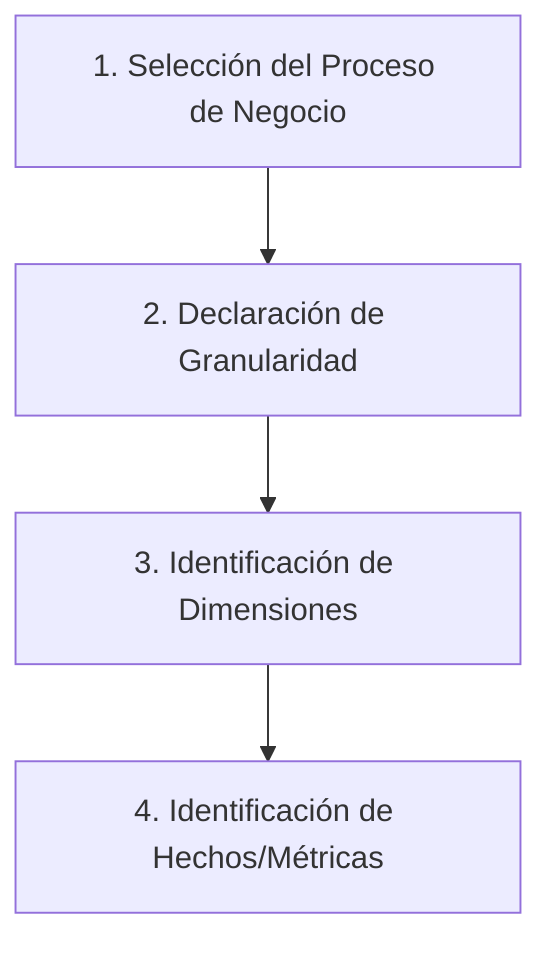

# CAPÍTULO III: DESARROLLO Y APLICACIÓN METODOLÓGICA

En el presente capítulo se detalla el desarrollo e implementación del sistema analítico y de predicción bajo la metodología del Ciclo de Vida Dimensional de Ralph Kimball. Se cubren las etapas desde la recolección de los requerimientos y modelado del negocio hasta la estructuración dimensional correspondiente.

---

## 1. Definición de Requerimientos del Negocio

### 1.1 Definición del Problema

Las organizaciones multisucursal modernas que operan con sistemas de planificación de recursos empresariales tradicionales (ERP) como _SAP SQL Anywhere_ enfrentan una fragmentación crítica de su información. El almacenamiento transaccional optimizado para operaciones de alta velocidad (OLTP) aísla los módulos de ventas, inventario, facturación, cuentas por cobrar y talento humano, impidiendo una visión holística.
Adicionalmente, la sobrecarga del motor operativo mediante consultas analíticas complejas o estimaciones manuales reduce drásticamente el rendimiento de facturación local en tiempo real.

Por otra parte, la entrada en vigencia de normativas de gobierno de datos, tales como la _Ley Orgánica de Protección de Datos Personales (LOPDP)_ en Ecuador, prohíbe el almacenamiento legible de Datos de Carácter Personal (DCP) en entornos analíticos sin estrictos roles de re-identificación. Esta falta de control expone a las organizaciones a fugas de datos y penalizaciones legales cuando analistas exponen registros reales.

### 1.2 Justificación

La implementación de un almacén de datos empresarial (_Data Warehouse_) complementado con modelos predictivos en un entorno de operaciones unificado permite segmentar la infraestructura de forma segura. El desarrollo de este modelo multidimensional no solo aísla al sistema central OLTP de bloqueos de tablas (_table-locking_), sino que transforma los datos planos e históricos de la corporación en activos y flujos predictivos de toma de decisiones operativas.

De esta manera, se justifica el diseño de un Data Warehouse estructurado bajo una **Constelación de Hechos**, alimentado dinámicamente mediante un flujo de extracción con anonimización incorporada y canalizado a través de servicios de comunicación web para la supervisión y cálculo de metas en tiempo real.

### 1.3 Objetivos del Sitema Analítico

- **Desplegar una Base de Datos Analítica (OLAP):** Consolidar la información dispersa de la base origen SAP en un repositorio optimizado PostgreSQL bajo un esquema estructurado en una constelación de hechos compartida.
- **Implementar un Flujo ETL con Privacidad desde el Diseño:** Garantizar la seguridad criptográfica del DW mediante hashing determinista irreversible SHA-256 para desasociar nombres y cédulas reales de clientes y empleados.
- **Diseñar Servicios y Dashboards Orientados a Perfiles (RBAC):** Automatizar el consumo analítico diferenciado por roles jerárquicos (Gerente, Bodega, Ventas, Administrador) y habilitar la re-identificación controlada en memoria del backend.
- **Integrar Modelos Estadísticos y Predictivos (MLOps):** Sustentar la toma de decisiones comerciales, niveles de reabastecimiento de stock y detección de anomalías transaccionales de auditoría directamente sobre los datos conformados.

### 1.4 Indicadores Clave de Rendimiento (KPIs)

Para guiar el análisis, se definieron los siguientes indicadores clave:

- **Margen de Utilidad Neta ($M$):**
  $$M = \frac{\text{Ventas Netas Totales} - \text{Costo Total de Ventas}}{\text{Ventas Netas Totales}} \times 100$$
- **Ticket Promedio ($TP$):**
  $$TP = \frac{\sum \text{Monto Neto Transacciones}}{\text{Cantidad Total de Transacciones Únicas}}$$
- **Porcentaje de Cumplimiento de Metas ($\%L_{v,m}$):**
  $$\%L_{v,m} = \left( \frac{\sum_{i} \text{Subtotal Neto}_{i,v}}{\text{Meta Comercial}_{v,m}} \right) \times 100$$
- **Comisión Asignada Dinámica (Liquidación):** Aplicación de incentivos proporcionales escalonados según el cumplimiento de metas ($\ge 90\% \Rightarrow 1\%$, $\ge 100\% \Rightarrow 2\%$ más bono de sobrecumplimiento).
- **Probabilidad de Deserción de Clientes/Churn Rate:** Inferencia estadística calculada (0.0 a 1.0) sobre la propensión de abandono de un cliente basándose en recencia, frecuencia e inactividad.
- **Días de Stock Proyectados (Bodega):**
  $$\text{Días de Stock} = \frac{\text{Existencia Física Actual}}{\text{Demanda Predictiva Diaria Estimada}}$$

---

## 2. Modelado Dimensional

El modelado multidimensional de la plataforma web analítica se rige de acuerdo a las cuatro decisiones del proceso de diseño de Ralph Kimball:

### 2.1 Selección del Proceso de Negocio

Se determinó la necesidad de analizar y cruzar de manera conformada las transacciones diarias centrales de la organización organizadas en las siguientes áreas operativas:

1.  **Ventas y Devoluciones:** Seguimiento de la facturación comercial neta y devoluciones de clientes.
2.  **Logística y Movimiento de Inventarios:** Control de existencias físicas de manera diaria por bodega y movimientos de kardex.
3.  **Compras y Abastecimiento:** Abastecimiento de mercancía a través de compras en firme.
4.  **Cuentas por Cobrar (CXC) y Cuentas por Pagar (CXP):** Cobros de cartera a clientes y egresos pendientes de proveedores.
5.  **Finanzas y Caja:** Monitoreo financiero analítico de cajas y arqueos de locales.
6.  **Recursos Humanos e Intelectuales:** Gestión del talento humano mediante consumos de nómina y metas comerciales operativas del staff.

### 2.2 Declaración Formal de la Granularidad

Para evitar la pérdida de fidelidad en la agregación de datos por parte de los analistas de negocio, se optó por la granularidad más fina disponible en los orígenes transaccionales del ERP SAP:

- **Granularidad de Ventas/Devoluciones/Compras:** Individualización de cada línea de ítem o artículo detallado dentro de un comprobante de venta, devolución o compra física.
- **Granularidad de Inventarios:** Registro consolidado diario (snapshot) del stock físico existente, costo promedio e indicadores de mínimos/máximos por combinación de producto y local corporativo. Para el kardex, se registra cada movimiento físico unitario de stock por transacción.
- **Granularidad de Cobros y Pagos:** Registro de cada movimiento transaccional de cobro de cartera o liquidación de factura de proveedor.
- **Granularidad de Nomina:** Registro mensual individualizado de rubros y haberes devengados por empleado de la institución.
- **Granularidad de Auditoría:** Cada transacción o alteración dentro del sistema capturada por el log del sistema operativo analítico.

### 2.3 Identificación de Dimensiones

Para contextualizar y dar soporte de consultas multidimensionales sobre las tablas de hechos, se construyeron once dimensiones conformadas compartidas:

1.  **`Dim_Fecha`:** Control cronológico con granularidad a nivel de día, mes, año, trimestre, semestre, periodo fiscal y banderas lógicas para feriados y fines de semana.
2.  **`Dim_Producto`:** Catálogo desnormalizado de mercancías (`codart`, línea, clase, subclase) estructurado mediante **Dimensión de Variación Lenta (SCD) Tipo 2** (`fecha_inicio_vigencia`, `fecha_fin_vigencia`, `es_vigente`) para preservar la correspondencia histórica de precios y costos.
3.  **`Dim_Cliente`:** Clientes del negocio seudonimizados criptográficamente mediante hashing unidireccional con sal (`hash_anonimo`), soportando históricos por cambio de categorización comercial bajo **SCD Tipo 2**.
4.  **`Dim_Sucursal`:** Mapeo de locales físicos y sucursales origen.
5.  **`Dim_Almacen`:** Ubicaciones y bodegas de almacenamiento asociadas a los establecimientos.
6.  **`Dim_Proveedor`:** Proveedores de compras.
7.  **`Dim_Vendedor`:** Agentes comerciales de ventas y cobros.
8.  **`Dim_Empleado`:** Personal operante en nómina.
9.  **`Dim_Usuario`:** Registro de usuarios autorizados.
10. **`Dim_FormaPago`:** Métodos y plazos de amortización financiera.
11. **`Dim_Geografia`:** Distribución territorial desnormalizada (provincia, cantón, parroquia).

### 2.4 Identificación de Hechos (Métricas)

Se definieron once bases de hechos para consolidar las tablas relacionales métricas del Data Warehouse relacional:

- **`Fact_Ventas_Detalle`:** Contiene cantidad colocada, precio e IVA unitarios, subtotal bruto, descuentos aplicados, costo de adquisición, total neta de venta y el margen generado evaluado linealmente.
- **`Fact_Inventario_Snapshot`:** Contiene balances de stock físico, costo promedio y valor total de inventarios, evaluando de forma automática de desabastecimientos.
- **`Fact_Movimientos_Inventario`:** Registra ingresos y salidas físicas de inventario (Kardex).
- **`Fact_Compras`:** Registra cantidades y montos monetarios en transacciones con proveedores.
- **`Fact_Cobros_CXC`:** Saldos cobrados de cartera y días acumulados de vencimiento.
- **`Fact_Pagos_CXP`:** Registro de egresos y saldos pendientes a proveedores.
- **`Fact_Nomina`:** Registra ingresos, horas extras, comisiones aplicadas al staff, deducciones y el neto neto a liquidar por empleado.
- **`Fact_Movimientos_Caja`:** Aperturas, cierres e inconsistencias detectadas en arqueos de sucursales.
- **`Fact_Metas_Comerciales`:** Montos objetivos asignados y cuotas de producto.
- **`Fact_Logs_Auditoria`:** Registro métrico de volumen físico de registros insertados o alterados por tablas del sistema.
- **`Fact_Devoluciones`:** Cantidades de ítems devueltos y crédito deudor derivado.

### 2.5 Matriz de Bus Dimensional

La matriz de bus a continuación mapea las relaciones de correspondencia lógica entre las dimensiones conformadas y las distintas tablas de hechos de la constelación:

| Dimensión / Hecho                 | `dim_fecha` | `dim_sucursal` | `dim_almacen` | `dim_producto` | `dim_cliente` | `dim_proveedor` | `dim_vendedor` | `dim_empleado` | `dim_usuario` | `dim_formapago` | `dim_geografia` |
| :-------------------------------- | :---------: | :------------: | :-----------: | :------------: | :-----------: | :-------------: | :------------: | :------------: | :-----------: | :-------------: | :-------------: |
| **`fact_ventas_detail`**          |      X      |       X        |               |       X        |       X       |                 |       X        |                |               |        X        |                 |
| **`fact_inventario_snapshot`**    |      X      |       X        |       X       |       X        |               |                 |                |                |               |                 |                 |
| **`fact_movimientos_inventario`** |      X      |       X        |       X       |       X        |               |                 |                |                |               |                 |                 |
| **`fact_compras`**                |      X      |       X        |       X       |       X        |               |        X        |                |                |               |                 |                 |
| **`fact_cobros_cxc`**             |      X      |       X        |               |                |       X       |                 |       X        |                |               |        X        |                 |
| **`fact_pagos_cxp`**              |      X      |       X        |               |                |               |        X        |                |                |               |        X        |                 |
| **`fact_nomina`**                 |      X      |       X        |               |                |               |                 |                |       X        |               |                 |                 |
| **`fact_movimientos_caja`**       |      X      |       X        |               |                |               |                 |                |                |       X       |        X        |                 |
| **`fact_metas_comerciales`**      |      X      |       X        |               |       X        |               |                 |       X        |                |               |                 |                 |
| **`fact_logs_auditoria`**         |      X      |       X        |               |                |               |                 |                |                |       X       |                 |                 |
| **`fact_devoluciones`**           |      X      |       X        |       X       |       X        |       X       |                 |                |                |               |                 |                 |
